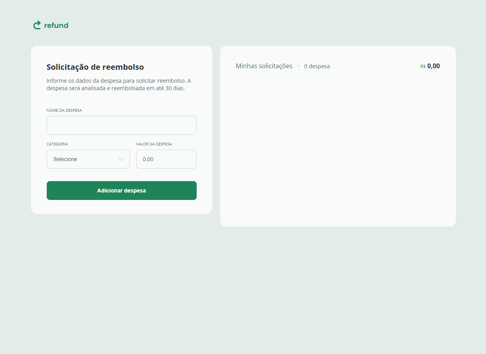

# Sistema de Solicitação de Reembolso

Este é um projeto de front-end para um sistema de solicitação de reembolso. Ele permite aos usuários registrar despesas, categorizá-las e visualizar o total de despesas solicitadas.

## Funcionalidades

- Formulário para registrar uma nova despesa, incluindo:
  - Nome da despesa.
  - Categoria (alimentação, hospedagem, serviços, transporte ou outros).
  - Valor da despesa (formatado automaticamente para BRL).
- Lista de despesas registradas com:
  - Nome da despesa.
  - Categoria e ícone correspondente.
  - Valor formatado.
  - Opção para remover despesas.
- Atualização dinâmica:
  - Total de despesas exibido.
  - Contador de despesas na lista.

## Tecnologias Utilizadas

- **HTML5**: Estrutura do projeto.
- **CSS3**: Estilização responsiva e acessível.
- **JavaScript**: Manipulação dinâmica de DOM, validação de entradas e lógica do sistema.

## Estrutura do Projeto

- `index.html`: Arquivo principal contendo a estrutura do sistema.
- `styles.css`: Estilos para o design e responsividade.
- `script.js`: Lógica para manipulação dinâmica do sistema e interação do usuário.

## Melhorias Futuras

- Integração com um banco de dados para armazenamento persistente.
- Implementação de autenticação de usuários.
- Suporte a múltiplas moedas.

---

Desenvolvido por [Osvaldo Alves](https://github.com/jerrytom20).
